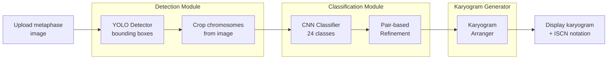

# BS-001: Metaphase Spread to Karyogram Generation UI

**Date**: 2026-05-19
**Status**: evaluated
**Providers**: fallback (orchestra unavailable)
**Score**: ICE 5.04 (Impact 9, Confidence 8, Ease 7)

## What/Why/Who/When

- **What**: Streamlit UI where users upload a raw metaphase spread image and the system generates a visual karyogram (sorted/arranged chromosome display) with ISCN notation
- **Why**: Current app produces text-only results. Clinical cytogenetics requires visual karyogram output as the gold standard for diagnosis and communication
- **Who**: Clinical cytogeneticists, research labs, students
- **When**: Builds on trained YOLO detector + CNN classifier pipeline (training/ module)

## Clarification Ledger

| Field | Status | Source | Confidence | Decision / Assumption | If Wrong | Plan Handoff |
|---|---|---|---:|---|---|---|
| goal | answered | user | 9 | Upload metaphase image -> generate visual karyogram with ISCN notation | N/A | requirement: upload -> detect -> classify -> visualize karyogram |
| scope_boundary | assumed | code | 7 | Extends existing Streamlit app. New modules under 300 lines each. New APIProvider mode | May need standalone app page | non-goal: rewriting app.py monolith |
| constraints | answered | code | 8 | 300-line file limit, CPU inference, preserve existing modes | CPU may be too slow for YOLO | constraint: file-size limit, CPU inference |
| done_evidence | assumed | user | 6 | Arranged karyogram image displayed in browser with labeled positions and ISCN notation | May expect interactive editing or pub-quality export | acceptance: visual karyogram + ISCN shown |
| brownfield_impact | answered | code | 8 | Adds new APIProvider mode, new modules, minimal change to app.py UI layer | Must not break existing 7 analysis modes | reviewer focus: backward compatibility |

## Visual Brief



**Karyogram Grid Layout:**
```
Row 1:  chr1  chr2  chr3  |  chr4  chr5       (Groups A + B)
Row 2:  chr6  chr7  chr8  chr9               (Group C part 1)
Row 3:  chr10 chr11 chr12                    (Group C part 2)
Row 4:  chr13 chr14 chr15                    (Group D)
Row 5:  chr16 chr17 chr18                    (Group E)
Row 6:  chr19 chr20                          (Group F)
Row 7:  chr21 chr22  |  X   Y               (Group G + Sex)
```

Each position shows a pair of cropped chromosome images side by side.

## Selected Approach: Modular Pipeline

### Architecture

New modules (each under 300 lines):

1. **`karyogram_generator.py`** — Pure function: takes list of (class_label, crop_image, confidence) tuples -> returns PIL Image of arranged karyogram
   - Standard 7-row grid layout by Denver groups
   - Chromosome labels below each pair
   - Abnormality highlighting (trisomy: 3rd chromosome in red box)
   - Returns metadata dict with ISCN notation

2. **`karyogram_ui.py`** — Streamlit UI components for the karyogram mode
   - Upload section
   - Progress display (detection -> classification -> arrangement)
   - Karyogram display with zoom
   - ISCN notation and clinical interpretation
   - Download button for karyogram image

3. **`ml_pipeline.py`** — Orchestrates YOLO detection + CNN classification
   - Loads YOLO detector and CNN classifier models
   - Runs detection -> crop -> classify -> refine
   - Returns structured results for karyogram generator
   - Graceful fallback to existing CV pipeline if YOLO weights missing

### Integration Points

- New `APIProvider.YOLO_KARYOGRAM` enum value in app.py
- New sidebar option "YOLO + Karyogram Generation"
- Minimal app.py changes: import new modules, add to provider list, add display function

### ICE Rationale

| Criterion | Score | Reasoning |
|-----------|-------|-----------|
| Impact | 9 | Fills the critical gap: metaphase -> visual karyogram. This is what clinical labs actually need |
| Confidence | 8 | All components exist (YOLO training pipeline, classifier, PIL image ops). Integration is well-understood |
| Ease | 7 | Moderate: 3 new modules + karyogram layout logic. Grid arrangement requires careful sizing. File size constraint adds overhead |

### Rejected Alternatives

| Alternative | Score | Rejection Reason |
|-------------|-------|------------------|
| Minimal Integration (inline in app.py) | 5.67 | Violates 300-line file limit; would bloat monolith further |
| Interactive Canvas | 0.72 | Over-engineering; speculative UX complexity for unvalidated need |
| Full Rewrite to multi-file app | 3.20 | Scope creep; not aligned with the specific feature request |

## Outcome Lock

- **User-visible outcome**: Upload metaphase image -> see arranged karyogram image + ISCN notation
- **Mandatory requirements**:
  1. YOLO-based chromosome detection from metaphase spread
  2. CNN 24-class classification
  3. Visual karyogram image generation (standard grid layout)
  4. Streamlit UI integration as new analysis mode
- **Non-goals**: Interactive editing, ideogram overlay, batch processing UI, replacing existing modes
- **Completion evidence**: User uploads metaphase PNG -> karyogram image displays in browser with labeled chromosome pairs and ISCN notation

## Evolution Ideas

- Interactive chromosome re-assignment (drag-and-drop correction)
- Ideogram band overlay on arranged chromosomes
- Side-by-side comparison with reference karyograms
- Publication-quality PDF/SVG export
- Confidence heatmap overlay on karyogram
- Multi-image batch processing UI with summary table
