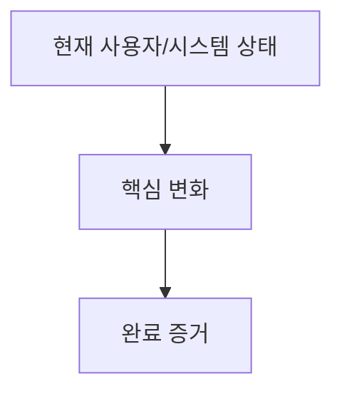

# Planning Skill

새로운 기능을 기획하고 요구사항을 분석하는 스킬입니다.

## 기획 프로세스

### 1단계: 목표 명확화

사용자의 요청을 분석하여 핵심 목표를 도출합니다:
- **What**: 무엇을 만들 것인가?
- **Why**: 왜 필요한가?
- **Who**: 누구를 위한 것인가?
- **When**: 언제 필요한가?

### 1.5단계: 시각 설명 구성

요구사항을 쓰기 전에 사용자에게 보여줄 `Visual Brief`를 구성합니다:
- 워크플로우/상태 전이/의사결정이 핵심이면 Mermaid `flowchart`를 사용합니다.
- 화면이나 사용자 조작이 핵심이면 저충실도 텍스트 wireframe을 사용합니다.
- UI가 없는 CLI/API/백엔드 작업이면 sequence/data-flow/command-flow 다이어그램을 사용합니다.
- Visual Brief는 설명 보조 자료입니다. 요구사항과 인수 기준에는 Outcome Lock에 연결된 항목만 반영합니다.

### 2단계: 요구사항 분석

EARS (Easy Approach to Requirements Syntax) 형식으로 요구사항을 작성합니다:

- **WHERE** 조건이 발생할 때, **THE SYSTEM SHALL** 동작을 수행해야 한다
- **WHILE** 상태에 있는 동안, **THE SYSTEM SHALL** 동작을 수행해야 한다
- **WHEN** 트리거 조건이 발생하면, **THE SYSTEM SHALL** 동작을 수행해야 한다

### 3단계: 엣지 케이스 식별

잠재적 위험 요소와 예외 상황을 파악합니다:
- 입력 유효성 검사 실패
- 네트워크 오류
- 동시성 충돌
- 권한 부족

### 4단계: OKR 정렬

기능이 상위 목표에 어떻게 기여하는지 명시합니다:

| 항목 | 설명 |
|------|------|
| **Objective** | 이 기능이 기여하는 상위 목표 |
| **Key Result** | 이 기능으로 달성 가능한 측정 가능한 결과 |
| **Alignment** | 직접 기여(Direct) / 간접 기여(Indirect) / 지원(Enabler) |

OKR이 프로젝트에 정의되어 있지 않으면 이 단계를 건너뜁니다.

### 5단계: 이해관계자 매핑

기능에 영향을 받는 이해관계자를 Power/Interest 그리드로 분류:

```
           High Power
    ┌──────────┬──────────┐
    │  Manage  │  Engage  │
    │ closely  │ actively │
Low ├──────────┼──────────┤ High
Int │ Monitor  │   Keep   │ Interest
    │  only    │ informed │
    └──────────┴──────────┘
           Low Power
```

- **Engage actively** (High Power + High Interest): 의사결정자, 핵심 사용자 → 요구사항 심층 반영
- **Manage closely** (High Power + Low Interest): 경영진, 리더 → 정기 업데이트
- **Keep informed** (Low Power + High Interest): 파워 유저, 커뮤니티 → 변경 알림
- **Monitor** (Low Power + Low Interest): 간접 영향 그룹 → 최소 커뮤니케이션

### 6단계: 구현 우선순위 결정

MoSCoW 방식으로 우선순위를 분류합니다:
- **Must Have**: 반드시 필요한 핵심 기능
- **Should Have**: 있으면 좋은 중요 기능
- **Could Have**: 여유가 있으면 구현할 선택적 기능
- **Won't Have**: 이번 릴리즈에서 제외할 기능

## 출력 형식

기획 완료 후 다음 형식으로 요약을 제공합니다:

````markdown
## 기능 기획 요약

**기능명**: [이름]
**목적**: [한 줄 설명]

### Visual Brief



```text
[Wireframe or flow sketch]
- UI가 있으면 주요 화면/상태/행동을 배치합니다.
- UI가 없으면 sequence/data-flow/command-flow로 대체합니다.
```

### 요구사항
- [ ] [EARS 형식 요구사항 1]
- [ ] [EARS 형식 요구사항 2]

### 엣지 케이스
- [예외 상황 1]
- [예외 상황 2]

### 구현 우선순위
- **Must**: [핵심 기능]
- **Should**: [중요 기능]
````
