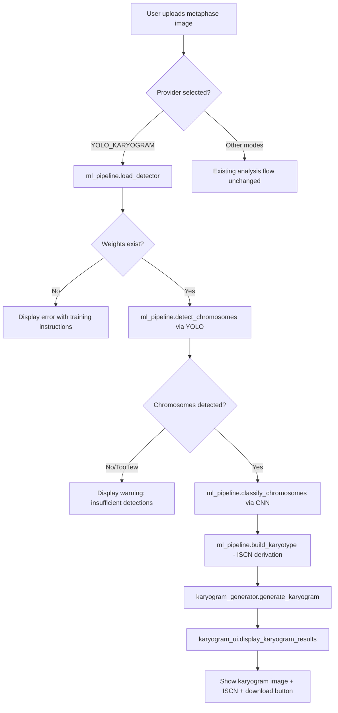

# SPEC-KARYO-001 Implementation Plan

## Task List

- [ ] T1: Create ml_pipeline.py -- ML inference orchestrator
- [ ] T2: Implement YOLO detection wrapper with weight loading and fallback
- [ ] T3: Implement CNN classification wrapper with ChromosomeNet loading
- [ ] T4: Create karyogram_generator.py -- visual karyogram image renderer
- [ ] T5: Create karyogram_ui.py -- Streamlit UI components for karyogram mode
- [ ] T6: Integrate into app.py -- add YOLO_KARYOGRAM enum, sidebar entry, routing

## Implementation Strategy

### T1: ml_pipeline.py (~200 lines)

Create a new module that orchestrates the full inference pipeline. This module reuses the model architecture from training/predict.py (ChromosomeNet, _crop_tensor, _refine_predictions, _build_karyotype) but adapts it for in-process Streamlit use rather than CLI batch processing.

Key functions:
- load_detector(weights_path) -> YOLO: Load YOLOv8 model with existence check.
- load_classifier(weights_path, device) -> ChromosomeNet: Load CNN weights with state dict handling.
- detect_chromosomes(detector, image_pil, conf_threshold) -> list[dict]: Run YOLO inference, return list of {bbox, crop_tensor} dicts.
- classify_chromosomes(classifier, crops, device) -> list[dict]: Batch CNN inference, softmax, pair refinement. Return {bbox, class_label, confidence} per detection.
- build_karyotype(labels) -> dict: Derive sex chromosomes, abnormalities, ISCN notation, Denver groups. Adapted from training/predict.py::_build_karyotype.
- run_pipeline(image_pil, detector, classifier, device, conf) -> dict: Full pipeline: detect -> classify -> karyotype. Returns structured result with classifications, notation, sex, abnormalities, denver_groups, and PIL crops for karyogram rendering.

Reuse strategy: The ChromosomeNet architecture and constants (IDX_TO_LABEL, CROP_H, CROP_W, NUM_CLASSES) are defined inline in ml_pipeline.py rather than imported from training/predict.py, because predict.py is a CLI script and importing it would couple the web app to the training directory structure. The refinement and karyotype logic (~50 lines) is also inlined to keep the web app self-contained.

### T2: YOLO detection wrapper (within T1)

- Check Path(weights_path).exists() before YOLO(weights_path).
- Return structured error dict on missing weights with a suggestion to run training/train_detector.py.
- Filter detections: skip boxes where width < 4 or height < 4.
- Convert xyxy format to xywh for crop compatibility.

### T3: CNN classification wrapper (within T1)

- Use torch.load(weights_path, map_location=device, weights_only=True) with state dict extraction.
- Handle both raw state dict and model_state_dict checkpoint formats.
- Return structured error dict on missing weights with a suggestion to run training/train_classifier.py.

### T4: karyogram_generator.py (~250 lines)

Create a new module that renders classified chromosome crops into a standard karyogram grid image.

Key functions:
- generate_karyogram(classifications, source_image, target_height) -> PIL.Image: Main entry point. Takes classification results (each with bbox, class_label, confidence) and the source image, returns a rendered karyogram PIL Image.
- _group_by_denver(classifications) -> dict[str, list]: Group classified chromosomes by Denver group (A-G + sex).
- _sort_within_group(group_items) -> list: Sort chromosomes within each group by class number, then pair homologs.
- _crop_and_normalize(source_image, bbox, target_height) -> PIL.Image: Crop from source, convert to grayscale, resize to uniform height while preserving aspect ratio.
- _render_grid(grouped_crops, target_height) -> PIL.Image: Layout algorithm with 7 rows, Denver group separators, labeled chromosomes, paired side by side.

Grid layout (from BS-001):

```
Row 1: chr1  chr2  chr3 | chr4  chr5          (Groups A + B)
Row 2: chr6  chr7  chr8  chr9                 (Group C part 1)
Row 3: chr10 chr11 chr12                      (Group C part 2)
Row 4: chr13 chr14 chr15                      (Group D)
Row 5: chr16 chr17 chr18                      (Group E)
Row 6: chr19 chr20                            (Group F)
Row 7: chr21 chr22 | X  Y                    (Group G + Sex)
```

Each chromosome position shows the homologous pair (2 copies) side by side. Group separators are vertical lines. Labels are drawn below each pair. Missing chromosomes (monosomy) show a single copy with a gap marker. Extra chromosomes (trisomy) show 3 copies.

Rendering details:
- White background (RGB 255,255,255).
- Chromosome crops normalized to uniform height (default 100px), width scaled proportionally.
- 10px horizontal gap between pair members, 30px between different chromosomes, 50px between Denver groups.
- Group labels (A, B, etc.) drawn at group start.
- Chromosome labels (1, 2, ..., X, Y) drawn below each pair.
- PIL.ImageDraw for lines, PIL.ImageFont for labels (DejaVuSans fallback to default).

### T5: karyogram_ui.py (~180 lines)

Create Streamlit UI components for the karyogram analysis mode.

Key functions:
- display_karyogram_analysis(image, detector, classifier, device, conf) -> None: Main UI flow with progress bar, spinner, pipeline call, karyogram generation, and result display.
- display_karyogram_results(result, karyogram_image) -> None: Display karyogram image, ISCN notation, chromosome count, sex determination, abnormalities, Denver group distribution table.
- display_karyogram_download(karyogram_image) -> None: Download button for karyogram PNG.
- display_karyogram_error(error_dict) -> None: Display error messages for missing weights or failed detection.

State management: Uses st.session_state keys prefixed with karyogram_ to avoid collision with existing session state keys (analysis_result, uploaded_image, etc.).

### T6: app.py integration (~30 lines changed)

Minimal changes to the existing monolith:

1. Add import guard (top of file, after existing try/except blocks):
   - try/except for torch, setting TORCH_AVAILABLE flag.

2. Add enum value to APIProvider:
   - YOLO_KARYOGRAM = "YOLO Karyogram (ML Pipeline)"

3. Add sidebar entry in display_sidebar_settings() (after existing provider options):
   - Insert "YOLO Karyogram (ML Pipeline)" when TORCH_AVAILABLE and YOLO_AVAILABLE.

4. Add provider_map entry mapping the display string to APIProvider.YOLO_KARYOGRAM.

5. Add routing in main() to call karyogram_ui.display_karyogram_analysis when YOLO_KARYOGRAM is selected.

Backward compatibility: All existing modes remain unchanged. The YOLO_KARYOGRAM option only appears when torch and ultralytics are installed. No existing function signatures or session state keys are modified.

## Visual Planning Brief



## Feature Completion Scope

- **Primary SPEC closes Outcome Lock**: This SPEC delivers all four mandatory requirements (YOLO detection, CNN classification, visual karyogram generation, Streamlit UI integration) as a single cohesive pipeline. No sibling SPECs are needed.
- **Approved sibling dependencies**: None.
- **Completion Debt**: None. The trained YOLO weights (best.pt) and CNN weights (chromosome_classifier.pth) already exist in the repository from prior training runs.
