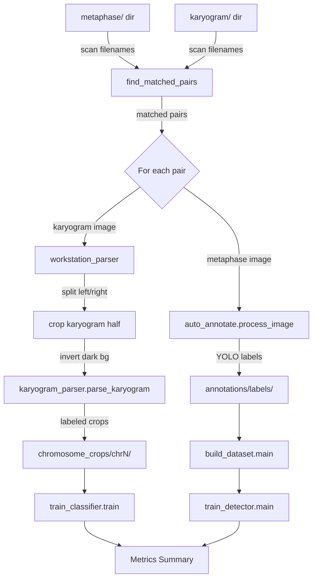

# SPEC-TRAIN-001 Implementation Plan

## Task List

- [ ] T1: Create `workstation_parser.py` — workstation screenshot splitter and background inverter
  - Implement `detect_split_boundary(gray)` using column-wise pixel intensity variance to find the vertical divide between the metaphase (left) and karyogram (right) halves.
  - Implement `crop_karyogram_region(image_path)` that loads the RGBA image, detects the split, crops the right half, and trims toolbar/ISCN text regions by detecting horizontal bands of uniform intensity at the top and bottom.
  - Implement `invert_if_dark(gray)` that checks median intensity; if below 128, inverts the image so chromosomes are dark-on-light.
  - Implement `parse_workstation_image(image_path, output_dir, padding)` that chains: load -> crop karyogram half -> invert -> save temp file -> call `karyogram_parser.parse_karyogram()` -> return counts dict.
  - Implement CLI `main()` with `--input_dir` and `--output_dir` arguments.
  - Target: under 200 lines.

- [ ] T2: Create `pair_trainer.py` — filename-matching and orchestration
  - Implement `normalize_stem(filename)` that strips leading zeros from numeric segments for fuzzy matching (e.g., `26-k-0659` -> `26-k-659`).
  - Implement `find_matched_pairs(metaphase_dir, karyogram_dir)` that returns matched `(metaphase_path, karyogram_path)` tuples and logs unmatched files to stderr.
  - Implement pipeline orchestration in `run_pipeline(args)`:
    1. Find matched pairs via `find_matched_pairs()`.
    2. For each karyogram image: call `workstation_parser.parse_workstation_image()` to extract labeled crops.
    3. For each metaphase image: call `auto_annotate.process_image()` to generate YOLO labels.
    4. Call `build_dataset.main()` with constructed argv for augmented YOLO dataset assembly.
    5. Call `train_detector.main()` if ultralytics is available, else skip with warning.
    6. Call `train_classifier.train()` with constructed args namespace.
    7. Print final metrics summary.
  - Implement CLI `main()` with `--metaphase_dir`, `--karyogram_dir`, `--output_dir`, `--epochs_detector`, `--epochs_classifier`, `--aug_factor`, `--device` arguments.
  - Target: under 300 lines.

- [ ] T3: Wire workstation parser output into existing dataset builders
  - Confirm `workstation_parser` saves crops to `chromosome_crops/{chrN}/*.png` (same layout as `karyogram_parser.py` output, compatible with `ChromosomeDataset` in `train_classifier.py`).
  - Confirm `auto_annotate` output goes to `annotations/labels/` (compatible with `build_dataset.py --labels_dir`).
  - No code changes to existing scripts; only the new orchestrator calls them with correct paths.

- [ ] T4: Configure augmentation and training parameters for small dataset
  - Default `--aug_factor 5` in pair_trainer (8 images x 5 augmentations = 40 effective training images for YOLO).
  - Default `--epochs_detector 50` and `--epochs_classifier 30` (CPU-friendly).
  - Freeze 10 YOLO backbone layers by default (existing `train_detector.py` default).
  - Increase classifier augmentation: `RandomRotation(20)`, `ColorJitter(0.4, 0.4)`, `RandomAffine` via the existing `train_classifier.py` transforms.

- [ ] T5: Add metrics summary reporter to pair_trainer
  - After detector training: parse mAP@0.5 from `results.results_dict` (or "N/A" if ultralytics unavailable).
  - After classifier training: run `evaluate()` from `train_classifier.py` and extract top-1 and top-3 accuracy.
  - Print structured summary to stdout: pairs processed, crops per class, mAP, top-1, top-3.

## Implementation Strategy

**Approach**: Add two new Python files to the existing `training/` directory. Both files import from existing modules (`karyogram_parser`, `auto_annotate`, `build_dataset`, `train_detector`, `train_classifier`) without modifying them. The workstation parser handles the clinical screenshot format and delegates chromosome extraction to the existing parser. The pair trainer orchestrates the full pipeline.

**Key technical decisions**:
- Split detection uses column-wise intensity variance: the metaphase half is darker/busier than the karyogram half, and the split is typically a vertical toolbar or clear dividing line near the image center.
- Filename normalization uses regex to strip leading zeros from numeric segments rather than exact string matching, because the karyogram directory has `26-k-659` while metaphase has `26-k-0659`.
- The aug_factor default is 5 (higher than the existing `build_dataset.py` default of 3) because 8 paired images is a small dataset.
- Training is sequential (detector then classifier) because they are independent models sharing the same data source.

## Visual Planning Brief

## Feature Completion Scope

The Primary SPEC closes the Outcome Lock with tasks T1-T5. No sibling SPECs are needed. The pair trainer orchestrates existing modules without modifying them, and produces end-to-end training results from paired data. No Completion Debt remains.
